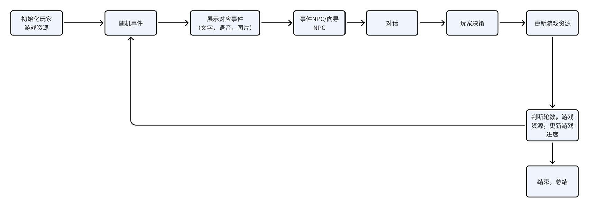
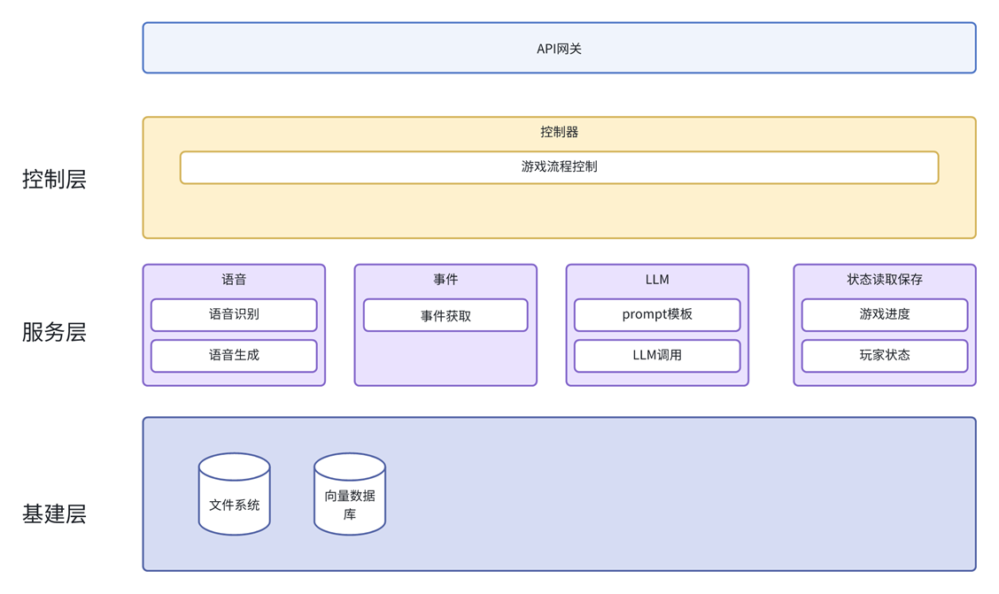
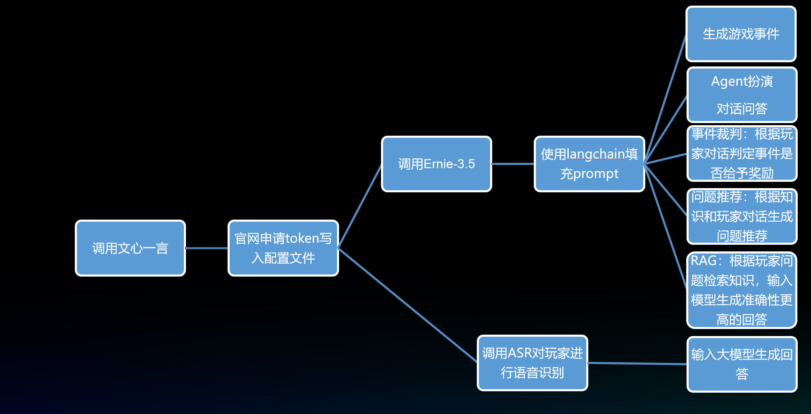

# 智途问答大冒险
《智途问答大冒险》是一款结合AI与随机事件冒险游戏机制的多模态科普应用。游戏以《十万个为什么》为基础，通过丰富的游戏事件和AI智能问答系统，引导孩子们在游戏中学习科普知识，激发好奇心，培养主动学习和提问的习惯。游戏不仅提供丰富的知识内容，还通过智能问答和语音对话等形式，让孩子们在互动中享受学习的乐趣，而不是单向接受知识。

# 启动方式
执行python ui.gradio.py
# 核心功能
**游戏冒险**
结合随机事件游戏机制，让玩家在游戏中遭遇各种事件，以事件作为引子，进行科普。
**AI问答**
通过文心一言大模型实现智能问答系统，结合RAG技术，实时解答玩家的疑问，提供科普知识和答案解释。
**AI角色对话**
使用文心一言大模型为游戏内重要NPC提供Agent扮演，提高沉浸感。
**语音对话**
调用Appbuilder-sdk的asr和tts功能实现实时、快速语音识别和生成，让玩家通过语音与游戏进行互动，提升游玩体验。
使用chattts提前对固定内容进行语音生成，生成高拟人程度的语音播放。

# 实现细节
## 事件生成工作流

## 事件设计
**人物交流事件：**
应用根据事件人物的背景和目的，生成prompt，并且将对应问答对一起组成事件的NPC Agent，需要玩家与其交流达成人物目的，最后事件的成功与失败的判定由另一个裁判Agent读取对话历史进行判定。
该事件类型利用大模型的对话扮演能力，让玩家直接与事件人物进行交流，将科普知识融入对话，提高游戏的沉浸感。
**选择事件**
玩家需要根据事件背景进行决策，选择选项，获得对应的奖励和惩罚。玩家需要对其中的名词有一定的了解才能进行明确地选择，如果不了解，可以直接询问向导Agent进行科普。
**战斗事件**
该事件玩家需要根据资源进行战斗，以进行奖励和惩罚，增加游戏的挑战性。

## 游戏流程

游戏轮数：初步设定为16轮，每5轮固定遇到战斗事件，战斗失败则游戏结束；16轮通关后进行积分结算。
事件抽取：抽取事件进行展示，并将事件信息和知识输入对应Agent进行问答
事件内容展示：根据抽取事件ID从事件库中获取事件内容，并放入历史中防止二次抽取
事件选项选择：根据选择的选项奖励，更新对应资源
画廊展示：提供数据集中对应知识的图片
问答机器人：根据科普知识，回答玩家疑问或者扮演NPC
问题推荐：为不知道提问方向的玩家提供问题推荐
语音识别与播放：识别麦克风语音，转为文本输入大模型进行提问；实时流式播放事件内容、结果、对话。
## 游戏系统架构

## 大模型调用
